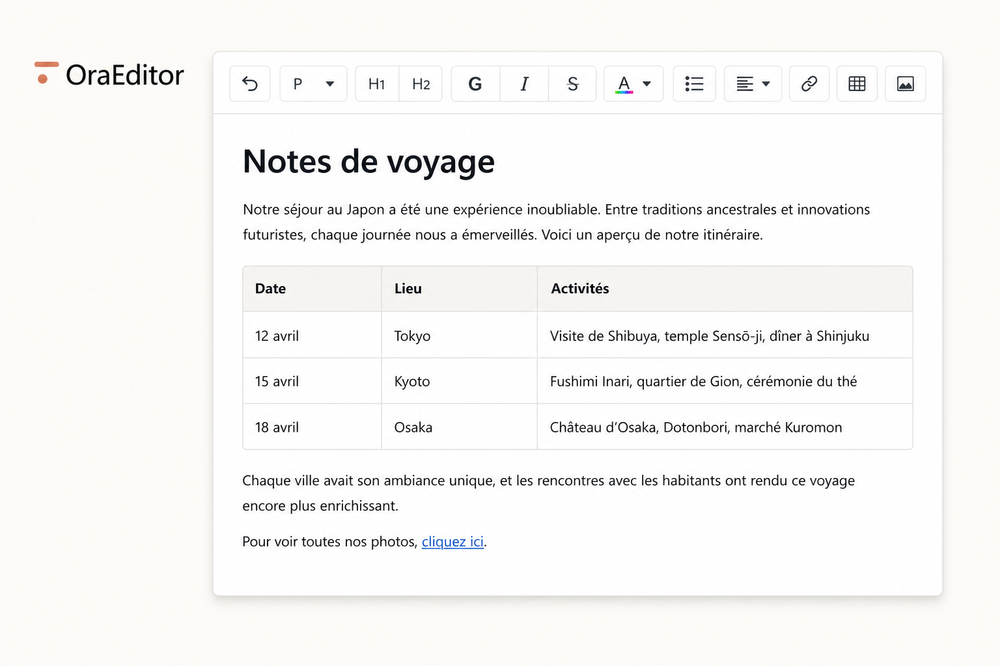

# OraEditor



Éditeur de contenu riche, autonome et offline. Le moteur TypeScript ne dépend d’aucun backend ni framework UI.

- **[Documentation HTML](Docs/index.html)** — FR, EN, PO/PT, ES, IT, RU, DE
- [Démarrage](docs/getting-started.md)
- [Architecture](docs/architecture.md)
- [Document Model](docs/document-model.md)
- [API](docs/api.md)
- [Installer / IA / Update](docs/integration.md)
- [Laravel](packages/laravel/README.md)
- [Packaging](docs/packaging.md)
- [Contribuer](docs/contributing.md)

Kit prêt à coller dans un projet (cPanel, PHP…) : dossier **`ready/ora-editor/`** — rien à compiler. Ouvrez ensuite `/ora-editor/editeur.html`.

```bash
npm install
npm test
npm run dev
```
